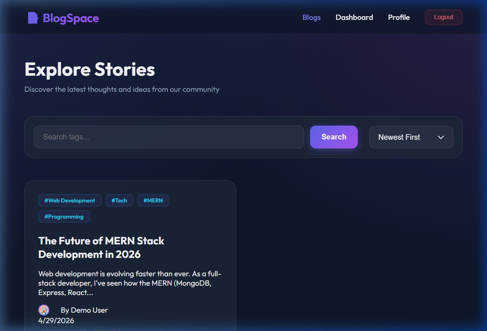
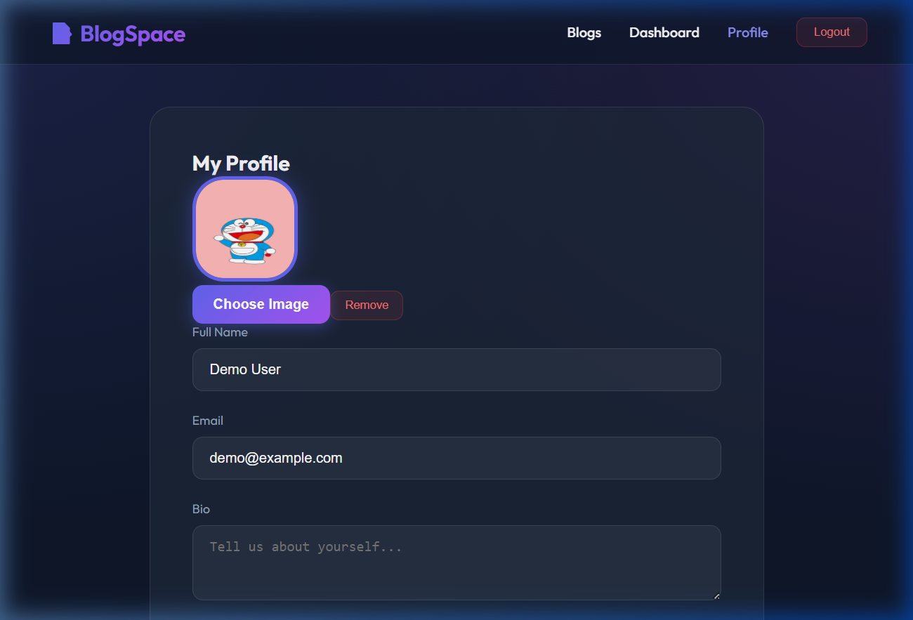
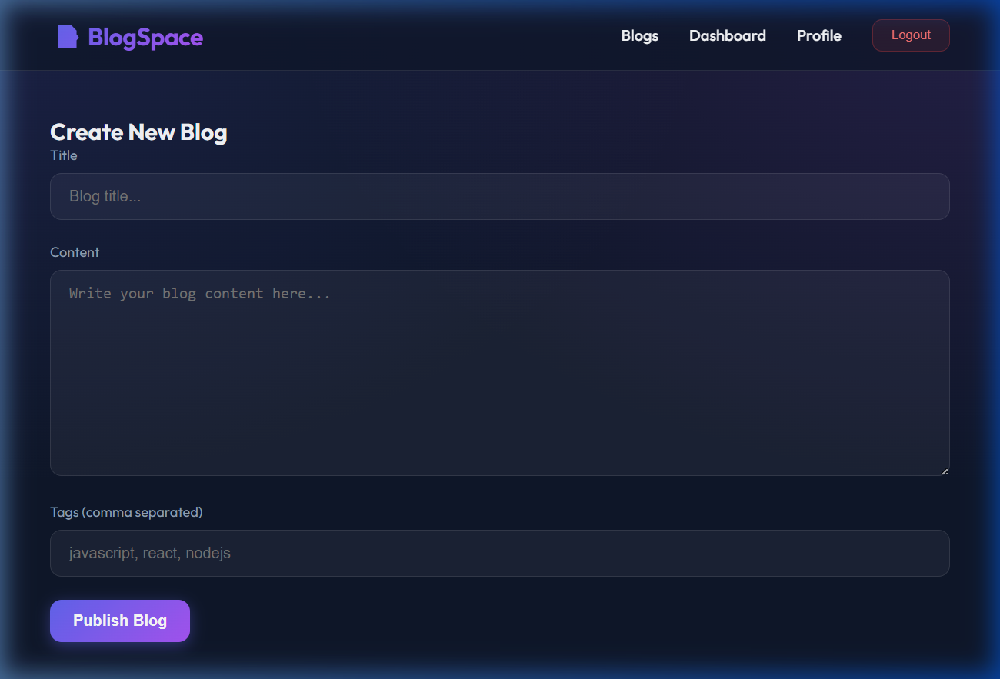
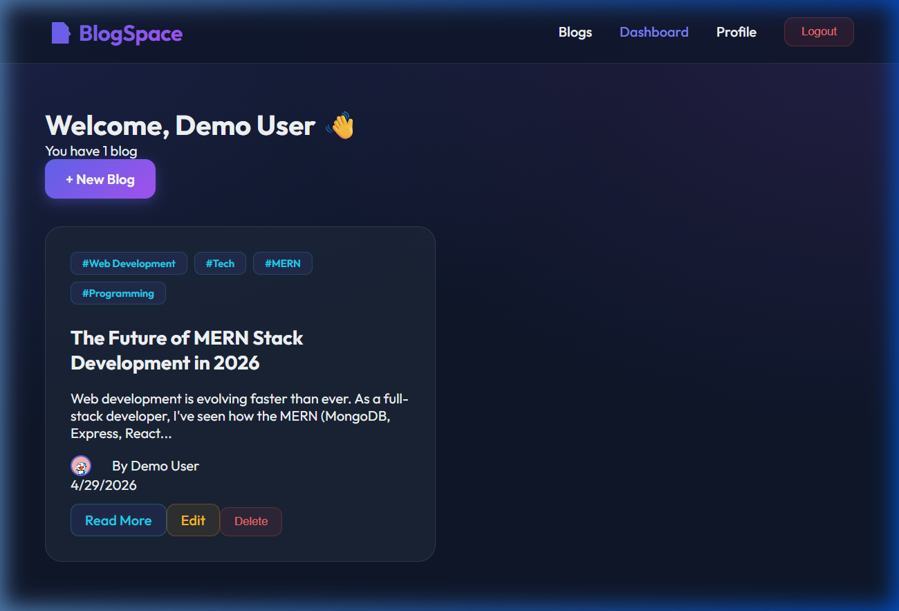

# 📝 BlogSpace - Premium MERN Stack Blog Platform

[](https://syntecxhub-premium-mern-blog-platfo.vercel.app/)
[](https://syntecxhub-premium-mern-blog-platform.onrender.com)
[](https://www.mongodb.com/)
[](https://opensource.org/licenses/MIT)

**BlogSpace** is a high-performance, full-stack blogging solution built for creators who demand a premium user experience. Featuring a sleek **Glassmorphism UI**, secure **JWT authentication**, and a scalable **Node/Express architecture**, it's more than just a blog—it's a complete content ecosystem.

---

## 🚀 Live Demo

🔗 **Explore the App:** [https://syntecxhub-premium-mern-blog-platfo.vercel.app/](https://syntecxhub-premium-mern-blog-platfo.vercel.app/)

> [!NOTE]
> **Cold Start Alert:** Since the backend is hosted on Render's free tier, the initial request might take **30-50 seconds** to wake up the server. Please stay on the page—it's worth the wait!

---

## 🔐 Test Credentials
Want to skip signup? Use these demo details to explore the dashboard instantly:
*   **Email:** `demo@example.com`
*   **Password:** `demo1234`

---

## 📸 Screenshots & UI/UX

| 🏠 Home Dashboard (Glassmorphism) | 👤 Professional User Profile |
| :---: | :---: |
|  |  |
| *Sleek dark mode with dynamic cards* | *Real-time avatar & bio updates* |

| ✍️ Content Creation Suite | 📊 User Dashboard |
| :---: | :---: |
|  |  |
| *Clean, distraction-free writing* | *Manage your posts effortlessly* |

---

🔗 **Watch the Demo on LinkedIn:** [Click here to view the project walkthrough](https://www.linkedin.com/posts/raghvendra-yadav-a0a5b92b5_syntecxhub-mernstack-fullstackdeveloper-activity-7455324073196261377-hS1s)

---

## ✨ Premium Features

### 🛡️ Enterprise-Grade Security
*   **JWT-Based Auth:** Secure session management with encrypted tokens.
*   **BCrypt Hashing:** Industry-standard password protection.
*   **Role-Based Access:** Authors have full control over their own content only.

### 🎨 Stunning Modern UI
*   **Glassmorphism Design:** Beautiful translucent panels and blur effects.
*   **Framer Motion:** Fluid transitions and micro-animations for a "luxury" feel.
*   **Mobile First:** 100% responsive design across all devices.

### ⚙️ Robust Content Engine
*   **Full CRUD:** Create, edit, and manage articles with ease.
*   **Smart Categorization:** Tag-based system for easy navigation.
*   **Optimized Performance:** Fast API responses with MongoDB indexing.

---

## 🛠️ Tech Stack & Architecture

### Frontend (Client-Side)
*   **React.js (Vite):** Blazing fast development and build times.
*   **Vanilla CSS:** Custom-crafted design system (No generic templates).
*   **Axios:** Robust HTTP client for secure API communication.

### Backend (Server-Side)
*   **Node.js & Express:** High-concurrency server architecture.
*   **MongoDB & Mongoose:** Scalable NoSQL database with flexible schema.
*   **Multer:** Specialized handling for professional file uploads.

---

## 💼 Hire Me for Your Next Project!
Are you looking for a dedicated developer to build your next SaaS, Dashboard, or Business Website? I specialize in:

*   ✅ **Full-Stack MERN Apps** (React, Node, MongoDB)
*   ✅ **Custom Dashboard Design** (Admin Panels & Analytics)
*   ✅ **API Development & Integration**
*   ✅ **Premium UI/UX Overhauls**

📩 **Contact me today:** [Your Email or LinkedIn]

---

## ⚙️ Installation (For Developers)

```bash
# 1. Clone & Install Backend
cd backend && npm install

# 2. Configure Environment
# Create .env in /backend:
# MONGO_URI, JWT_SECRET, PORT=5009

# 3. Start Development Servers
npm run dev # In both frontend & backend folders
```

---

## 👨‍💻 Author

**Raghvendra**
*   🚀 **GitHub:** [@Raghu9996](https://github.com/Raghu9996)
*   💼 **LinkedIn:** [Connect with me](https://www.linkedin.com/in/raghvendra-yadav-a0a5b92b5)
*   🌐 **Portfolio:** [Coming Soon]

---

## ⭐ Support the Project
If you find this project helpful for your learning or business, please give it a **Star**! it helps me stay motivated. ⭐

Copyright © 2026 BlogSpace. Built with ❤️ for the Developer Community.
